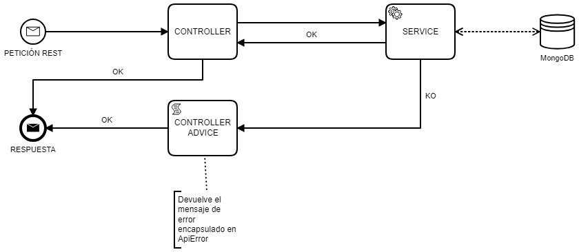

# Diseño de la aplicación

La función principal de la aplicación es un editor de textos orientados a lineas

## API Rest

Se ha optado por crear un **API REST** porque dispone de las acciones **CRUD**, muy indicadas para un editor de textos si contemplamos el documento como un almacenamiento de datos.

### Diagrama de flujo

### Estructura

Como la aplicación es algo sencilla se ha estructurado en una paqueteria diferenciada por funcionalidades de las clases: Configuracion (config), Controladores (controller), Modelo de Error (error), Excepciones (exception), Modelo (model) y Servicio o lógica de negocio (Service).

#### Configuración (config)

Contiene la configuracion referente a la base de datos, en este caso MongoDB. Se ha decidido llevar la configuración de la base de datos al archivo de configuración de la aplicacion ``application.yml`` para hacer que esta sea más fácil de configurar.

#### Controladores (controller)

Metiante un controlador REST se exponen las urls para que se lancen peticiones contra la aplicación. En este paquete también se encuentra el controlador o manejador de excepciones, encargado de devolver una respuesta con un código de estado de HTTP especifico en caso de que se lance alguna excepción del tipo que sea.

#### Modelo de error (error)

Modelo de respuesta en caso de que se produzca una excepción controlada.

#### Excepciones (exception)

Excepciones lanzadas en casos concretos.

#### Modelo (model)

Documento de la base de datos, utilizado tanto para peticiones como para respuestas de la aplicación.

#### Servicio (service)

Contiene toda la lógica del negocio con la base de datos.

## Base de datos

Dado que había varias posibilidades para almacenar los documentos creados, se optó por una base de datos **MongoDB**, ya que se trata de una bbdd NoSQL bastante enfocada a almacenar datos estructurados y muy enfocada a una aplicacion CRUD, como es el caso de un editor de textos. En este caso la estructura sería bastante sencilla, un identificaodr del documento (id) y el contenido del mismo (data).

En un primero momento se pensó en utilizar la funcionalidad BSON que permitia almacenar los datos binarios de los documentos. Pero dado que no se conocía el tamaño maximo de los documentos, se optó por utilizar GridFS ya que permite almacenar ficheros de mas de 16MB.

